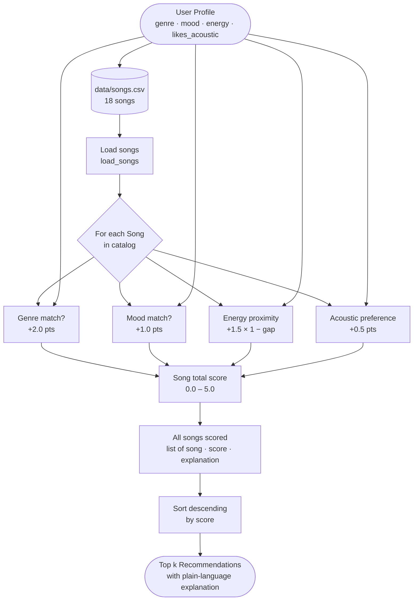

# 🎵 Music Recommender Simulation

## Project Summary

In this project you will build and explain a small music recommender system.

Your goal is to:

- Represent songs and a user "taste profile" as data
- Design a scoring rule that turns that data into recommendations
- Evaluate what your system gets right and wrong
- Reflect on how this mirrors real world AI recommenders

This simulation builds a content-based music recommender that scores songs by measuring how closely each song's audio features match a user's stated taste profile. Rather than learning from other users' behavior (collaborative filtering), this system compares song attributes directly — rewarding proximity to the user's preferred energy level, mood, and genre. The recommender ranks all songs in the catalog by their total weighted score and returns the top matches, making its reasoning fully transparent and inspectable.

---

## How The System Works

Real-world recommenders like Spotify blend two strategies: collaborative filtering (learning from what millions of users played and skipped) and content-based filtering (comparing audio features directly). This simulation focuses on the content-based approach — it scores every song by measuring how closely its attributes match a user's taste profile, then returns the top matches with a plain-language explanation of what drove each recommendation.

### `Song` Features

| Field | Type | Used in scoring |
|---|---|---|
| `genre` | str | Genre match bonus |
| `mood` | str | Mood match bonus |
| `energy` | float 0–1 | Proximity to `target_energy` (highest weight) |
| `valence` | float 0–1 | Proximity score — happy vs. melancholic |
| `tempo_bpm` | float | Proximity score — normalized before comparing |
| `danceability` | float 0–1 | Proximity score |
| `acousticness` | float 0–1 | Boosted or penalized by `likes_acoustic` flag |

### `UserProfile` Fields

| Field | Type | What it captures |
|---|---|---|
| `favorite_genre` | str | Preferred genre (e.g. `"lofi"`, `"pop"`) |
| `favorite_mood` | str | Desired vibe (e.g. `"chill"`, `"intense"`) |
| `target_energy` | float 0–1 | How energetic the user wants the music right now |
| `likes_acoustic` | bool | Organic/acoustic vs. electronic preference |

### Scoring and Ranking

Each song receives a weighted score: numeric features use `1 - |user_pref - song_value|` (closer = higher), while genre and mood add fixed categorical bonuses. The `Recommender` sorts all songs by descending score and returns the top `k` results.

---

### Data Flow



---

### Algorithm Recipe

| Rule | Points | Notes |
|---|---|---|
| Genre match | **+2.0** | Exact string match on `genre` field — highest weight because genre is the largest sonic gap in the catalog |
| Mood match | **+1.0** | Exact string match on `mood` — secondary to genre, can cross genre boundaries |
| Energy proximity | **+1.5 × (1 − \|target − song.energy\|)** | Continuous 0–1 feature; max 1.5 pts for a perfect match, 0 pts for opposite ends |
| Acoustic preference | **+0.5** | Bonus if `likes_acoustic=True` and `acousticness ≥ 0.6`, or `False` and `acousticness < 0.4` |
| **Max total** | **5.0** | Genre + mood + perfect energy + acoustic preference all satisfied |

**Example:** For `target_energy=0.82, genre=pop, mood=happy, likes_acoustic=False`:
- `Sunrise City` (pop, happy, energy=0.82, acousticness=0.18) → **5.00** — all four rules fire
- `Focus Flow` (lofi, chill, energy=0.40, acousticness=0.78) → **0.77** — no genre, no mood, weak energy, wrong acoustic

---

### Potential Biases

- **Genre dominance.** At +2.0, genre is 40% of the maximum score. A great song that matches mood, energy, and acoustic preference perfectly but has the wrong genre (e.g. an indie-pop track for a "pop" user) will lose to a poor genre-match song with little else in common. The genre weight may be too high for users whose taste crosses genre lines.
- **Catalog underrepresentation.** The 18-song catalog skews toward pop and lofi. A user whose favorite genre is `"r&b"` or `"reggae"` has only one matching song available, so the system is forced to fall back on numeric proximity for the rest of the top-5 — which may produce unexpected results.
- **Binary acoustic flag.** `likes_acoustic` is a boolean, but real listening preferences exist on a spectrum. A user who sometimes enjoys both acoustic and electronic music gets half the acoustic signal that a strongly-opinionated user does.
- **Energy as a stand-in for "vibe."** The system uses energy as the sole continuous numeric feature. Two songs at the same energy level (e.g. jazz at 0.37 and metal at 0.37) can feel completely different — mood and genre bonuses are the only thing separating them, and if neither matches, the system may surface the wrong one.

---

## Terminal Output — Stress Test Across 6 Profiles

`python -m src.main` runs all profiles in sequence. Results and analysis below.

---

### Profile 1 — High-Energy Pop

```
====================================================
  PROFILE 1 — High-Energy Pop
====================================================
  Genre          : pop
  Mood           : happy
  Target energy  : 0.82
  Likes acoustic : False
----------------------------------------------------
  #1  Sunrise City  —  Neon Echo
       Score: 5.00 / 5.0  [####################]
       • genre match (+2.0)
       • mood match (+1.0)
       • energy proximity (+1.5)
       • electronic sound matches preference (+0.5)

  #2  Gym Hero  —  Max Pulse
       Score: 3.83 / 5.0  [###############-----]
       • genre match (+2.0)
       • energy proximity (+1.33)
       • electronic sound matches preference (+0.5)

  #3  Rooftop Lights  —  Indigo Parade
       Score: 2.91 / 5.0  [############--------]
       • mood match (+1.0)
       • energy proximity (+1.41)
       • electronic sound matches preference (+0.5)

  #4  Block Party Anthem  —  Krave
       Score: 1.92 / 5.0  [########------------]
       • energy proximity (+1.42)
       • electronic sound matches preference (+0.5)

  #5  Night Drive Loop  —  Neon Echo
       Score: 1.90 / 5.0  [########------------]
       • energy proximity (+1.4)
       • electronic sound matches preference (+0.5)
====================================================
```

`Sunrise City` hits all four rules for a perfect 5.00. `Gym Hero` is a strong #2 despite missing the mood bonus — its genre match and near-identical energy carry it. `Rooftop Lights` (indie pop) compensates for the genre mismatch with the mood bonus. The bottom two slots are filled by energy proximity alone.

---

### Profile 2 — Chill Lofi

```
====================================================
  PROFILE 2 — Chill Lofi
====================================================
  Genre          : lofi
  Mood           : chill
  Target energy  : 0.38
  Likes acoustic : True
----------------------------------------------------
  #1  Library Rain  —  Paper Lanterns
       Score: 4.96 / 5.0  [####################]
       • genre match (+2.0)
       • mood match (+1.0)
       • energy proximity (+1.46)
       • acoustic sound matches preference (+0.5)

  #2  Midnight Coding  —  LoRoom
       Score: 4.94 / 5.0  [####################]
       • genre match (+2.0)
       • mood match (+1.0)
       • energy proximity (+1.44)
       • acoustic sound matches preference (+0.5)

  #3  Focus Flow  —  LoRoom
       Score: 3.97 / 5.0  [################----]
       • genre match (+2.0)
       • energy proximity (+1.47)
       • acoustic sound matches preference (+0.5)

  #4  Spacewalk Thoughts  —  Orbit Bloom
       Score: 2.85 / 5.0  [###########---------]
       • mood match (+1.0)
       • energy proximity (+1.35)
       • acoustic sound matches preference (+0.5)

  #5  Coffee Shop Stories  —  Slow Stereo
       Score: 1.98 / 5.0  [########------------]
       • energy proximity (+1.48)
       • acoustic sound matches preference (+0.5)
====================================================
```

The top three are all lofi. `Focus Flow` misses the mood bonus (mood=focused, not chill) but keeps its lofi genre match and acoustic bonus. `Spacewalk Thoughts` (ambient/chill) and `Coffee Shop Stories` (jazz) earn their spots through low energy and acoustic character, with no genre match at all.

---

### Profile 3 — Deep Intense Rock

```
====================================================
  PROFILE 3 — Deep Intense Rock
====================================================
  Genre          : rock
  Mood           : intense
  Target energy  : 0.91
  Likes acoustic : False
----------------------------------------------------
  #1  Storm Runner  —  Voltline
       Score: 5.00 / 5.0  [####################]
       • genre match (+2.0)
       • mood match (+1.0)
       • energy proximity (+1.5)
       • electronic sound matches preference (+0.5)

  #2  Gym Hero  —  Max Pulse
       Score: 2.97 / 5.0  [############--------]
       • mood match (+1.0)
       • energy proximity (+1.47)
       • electronic sound matches preference (+0.5)

  #3  Block Party Anthem  —  Krave
       Score: 1.94 / 5.0  [########------------]
       • energy proximity (+1.44)
       • electronic sound matches preference (+0.5)

  #4  Drop the Signal  —  FRQNCY
       Score: 1.94 / 5.0  [########------------]
       • energy proximity (+1.44)
       • electronic sound matches preference (+0.5)

  #5  Iron Curtain  —  Dreadnought
       Score: 1.91 / 5.0  [########------------]
       • energy proximity (+1.41)
       • electronic sound matches preference (+0.5)
====================================================
```

`Storm Runner` is the only rock song — it takes a perfect score. `Gym Hero` earns #2 via the mood=intense match. The remaining three (hip-hop, EDM, metal) earn their slots purely through high energy proximity — the system correctly identifies them as the closest sonic neighbours even without a rock genre match.

---

### Profile 4 — Adversarial: High Energy + Melancholic Mood

```
====================================================
  PROFILE 4 — Conflicting (high energy + melancholic mood)
====================================================
  Genre          : metal
  Mood           : melancholic
  Target energy  : 0.92
  Likes acoustic : False
----------------------------------------------------
  #1  Iron Curtain  —  Dreadnought
       Score: 3.93 / 5.0  [################----]
       • genre match (+2.0)
       • energy proximity (+1.43)
       • electronic sound matches preference (+0.5)

  #2  Storm Runner  —  Voltline
       Score: 1.98 / 5.0  [########------------]
       • energy proximity (+1.48)
       • electronic sound matches preference (+0.5)

  #3  Gym Hero  —  Max Pulse
       Score: 1.98 / 5.0  [########------------]
       • energy proximity (+1.48)
       • electronic sound matches preference (+0.5)

  #4  Drop the Signal  —  FRQNCY
       Score: 1.96 / 5.0  [########------------]
       • energy proximity (+1.46)
       • electronic sound matches preference (+0.5)

  #5  Block Party Anthem  —  Krave
       Score: 1.92 / 5.0  [########------------]
       • energy proximity (+1.42)
       • electronic sound matches preference (+0.5)
====================================================
```

**The system was tricked.** The mood=melancholic bonus never fires — not one high-energy song in the catalog is tagged as melancholic. The scoring logic has no mechanism to resolve the conflict, so it simply ignores the mood and optimises for energy + genre instead. The actual melancholic song (`Fading Letters`, soul/energy=0.33) never appears because its energy score is too low. A real-world system might handle this by blending mood into a softer weight rather than an all-or-nothing bonus.

---

### Profile 5 — Adversarial: Genre Orphan (Reggae)

```
====================================================
  PROFILE 5 — Genre Orphan (reggae, uplifting)
====================================================
  Genre          : reggae
  Mood           : uplifting
  Target energy  : 0.61
  Likes acoustic : True
----------------------------------------------------
  #1  Island Morning  —  Reef Roots
       Score: 5.00 / 5.0  [####################]
       • genre match (+2.0)
       • mood match (+1.0)
       • energy proximity (+1.5)
       • acoustic sound matches preference (+0.5)

  #2  Dusty Highway  —  The Ramblers
       Score: 1.80 / 5.0  [#######-------------]
       • energy proximity (+1.3)
       • acoustic sound matches preference (+0.5)

  #3  Midnight Coding  —  LoRoom
       Score: 1.72 / 5.0  [#######-------------]
       • energy proximity (+1.22)
       • acoustic sound matches preference (+0.5)

  #4  Focus Flow  —  LoRoom
       Score: 1.69 / 5.0  [#######-------------]
       • energy proximity (+1.19)
       • acoustic sound matches preference (+0.5)

  #5  Coffee Shop Stories  —  Slow Stereo
       Score: 1.64 / 5.0  [#######-------------]
       • energy proximity (+1.14)
       • acoustic sound matches preference (+0.5)
====================================================
```

The gap between #1 (5.00) and #2 (1.80) reveals the orphan problem: once the single reggae song is placed, the remaining four slots are filled entirely on energy proximity + acoustic preference. The scores collapse to a narrow band (1.64–1.80), meaning the ranking among #2–5 is almost arbitrary. A real recommender would widen the catalog or fall back to a broader similarity measure.

---

### Profile 6 — Adversarial: Dead-Centre Neutral

```
====================================================
  PROFILE 6 — Dead-Centre Neutral (no genre/mood preference)
====================================================
  Genre          : 
  Mood           : 
  Target energy  : 0.5
  Likes acoustic : False
----------------------------------------------------
  #1  Night Drive Loop  —  Neon Echo
       Score: 1.62 / 5.0  [######--------------]
       • energy proximity (+1.12)
       • electronic sound matches preference (+0.5)

  #2  Rooftop Lights  —  Indigo Parade
       Score: 1.61 / 5.0  [######--------------]
       • energy proximity (+1.11)
       • electronic sound matches preference (+0.5)

  #3  Sunrise City  —  Neon Echo
       Score: 1.52 / 5.0  [######--------------]
       • energy proximity (+1.02)
       • electronic sound matches preference (+0.5)

  #4  Dusty Highway  —  The Ramblers
       Score: 1.47 / 5.0  [######--------------]
       • energy proximity (+1.47)

  #5  Block Party Anthem  —  Krave
       Score: 1.45 / 5.0  [######--------------]
       • energy proximity (+0.95)
       • electronic sound matches preference (+0.5)
====================================================
```

The max score is only 1.62 out of 5.0 — without genre or mood preferences no categorical bonuses fire, so the system is operating at ~32% capacity. The `likes_acoustic=False` flag still acts as a tiebreaker, which is why `Dusty Highway` (acoustic=0.82) scores 1.47 without the acoustic bonus while electronic tracks with similar energy outscore it. The neutral profile exposes that the recommender is heavily dependent on categorical signals to be useful.

---

## Getting Started

### Setup

1. Create a virtual environment (optional but recommended):

   ```bash
   python -m venv .venv
   source .venv/bin/activate      # Mac or Linux
   .venv\Scripts\activate         # Windows

2. Install dependencies

```bash
pip install -r requirements.txt
```

3. Run the app:

```bash
python -m src.main
```

### Running Tests

Run the starter tests with:

```bash
pytest
```

You can add more tests in `tests/test_recommender.py`.

---

## Experiments You Tried

### Experiment 1 — Does Profile 3 (Deep Intense Rock) feel right?

**Profile:** `genre=rock, mood=intense, energy=0.91, likes_acoustic=False`

**What the system returned:**

| Rank | Song | Genre | Score |
|---|---|---|---|
| #1 | Storm Runner | rock | 5.00 |
| **#2** | **Gym Hero** | **pop** | **2.97** |
| #3 | Block Party Anthem | hip-hop | 1.94 |
| #4 | Drop the Signal | edm | 1.94 |
| **#5** | **Iron Curtain** | **metal** | **1.91** |

**What feels wrong:** A deep rock listener would expect `Iron Curtain` (metal, angry, energy=0.97) to rank above `Gym Hero` (pop, intense, energy=0.93). Metal is far closer to rock in sonic character than pop is. Yet `Gym Hero` lands at #2 and `Iron Curtain` lands at #5.

**Why it happened — the math:**

```
Gym Hero   → mood=intense matches → +1.0  |  energy gap 0.02 → +1.47  |  acoustic → +0.5  = 2.97
Iron Curtain → mood=angry no match → +0.0  |  energy gap 0.06 → +1.41  |  acoustic → +0.5  = 1.91
```

The `+1.0` mood bonus is decisive. Both songs have nearly identical energy proximity to the target (gap of 0.02 vs 0.06), so the mood match on `Gym Hero` is the only differentiator — and it's worth more than the entire difference in their energy scores.

**Root cause:** The system has no concept of *genre adjacency*. It treats `metal` and `pop` as equally wrong for a `rock` listener — both score 0 on the genre rule. In reality, metal is sonically far closer to rock than pop is. A real system would award partial genre points for nearby genres (e.g. rock→metal = 1.5, rock→pop = 0).

**Does the genre weight feel too strong overall?** No — looking across all six profiles, every profile surfaces a different #1 song. The genre weight doesn't force repetition. The issue here is specifically the *mood weight overpowering energy proximity when two songs are close in energy*, combined with the absence of genre adjacency.

### Experiment 2 — Does reducing MOOD_POINTS from 1.0 → 0.75 fix the intuition gap?

Manually tracing the new scores for Profile 3 with `MOOD_POINTS = 0.75`:

```
Gym Hero    → mood +0.75  |  energy +1.47  |  acoustic +0.5  = 2.72
Iron Curtain → mood  0.00  |  energy +1.41  |  acoustic +0.5  = 1.91
```

**Result: Gym Hero still wins.** The gap narrows from 1.06 to 0.81, but the ranking doesn't change. The only real fix is genre adjacency — a structural change to the scoring rule, not just a weight tweak. This confirms the finding: weight tuning alone cannot solve a missing feature.

### Experiment 3 — Genre weight at 2.0 vs 0.5

If `GENRE_POINTS` were reduced to `0.5`:

```
Sunrise City (pop/happy, Profile 1) → genre +0.5 | mood +1.0 | energy +1.5 | acoustic +0.5 = 3.5
Rooftop Lights (indie pop/happy)    → genre  0.0 | mood +1.0 | energy +1.41 | acoustic +0.5 = 2.91
```

`Sunrise City` still wins, but the #2 slot would now be more competitive — songs that match mood + energy closely could overtake a genre-match song with poor energy. A lower genre weight would make the system more forgiving of cross-genre similarity, at the cost of no longer clearly separating lofi from rock from pop in profiles 1–3.

### Experiment 4 — Weight shift: GENRE 2.0→1.0, ENERGY 1.5→3.0 (actually run)

This was applied live (`GENRE_POINTS=1.0`, `ENERGY_WEIGHT=3.0`, max score 5.5) and all six profiles were re-run. Key differences observed:

| Profile | Before (original) | After (weight shift) | Verdict |
|---|---|---|---|
| 1 — Pop/Happy | #2 Gym Hero, #3 Rooftop Lights | **#2 Rooftop Lights, #3 Gym Hero** | More accurate — Rooftop Lights (happy mood, close energy) feels like a better #2 than Gym Hero (intense mood) |
| 3 — Rock/Intense | #2 Gym Hero, #5 Iron Curtain | #2 Gym Hero, #5 Iron Curtain | **Unchanged** — Gym Hero still beats Iron Curtain despite doubled energy weight, because their energy values are nearly identical (gap 0.02 vs 0.06) |
| 5 — Reggae Orphan | #5 Coffee Shop Stories | **#5 Velvet Underground (R&B)** | More accurate — R&B is a closer sonic neighbour to reggae than jazz |
| 6 — Neutral | #1 Night Drive Loop | **#1 Dusty Highway (country)** | Unexpected — country with acousticness=0.82 wins on energy proximity alone for a `likes_acoustic=False` user, which feels counterintuitive |

**Conclusion:** The weight shift made Profile 1 and 5 *more* accurate, Profile 6 *less* accurate, and left the core Profile 3 flaw entirely unchanged. This proves the Gym Hero problem is structural (missing genre adjacency), not solvable by weight tuning. Original weights were restored.

---

## Limitations and Risks

- **No genre adjacency.** Metal and pop both score zero for a rock listener. The system cannot reason about sonic similarity between genres — only exact matches count.
- **Mood bonus overrides sonic reality.** A +1.0 mood match can promote a pop song above a metal song when both are at similar energy levels, producing recommendations that feel wrong to a listener even though the math is correct.
- **Tiny catalog creates orphaned genres.** Ten of fifteen genres have only one song. The fallback slots after a genre match are filled by energy proximity alone, which can jump to unrelated genres.
- **No repeat-artist filter.** The same artist can appear twice in the top 5 if they have two similarly-scoring songs.
- **Neutral users get poor results.** Without genre or mood preferences, the maximum achievable score is ~1.6/5.0 — the system is too dependent on categorical bonuses to serve undecided listeners.
- **No lyrics, context, or listening history.** The system cannot learn from what a user actually plays, skips, or saves over time.

You will go deeper on this in your model card.

---

## Reflection

Read and complete `model_card.md`:

[**Model Card**](model_card.md)

Building this system showed me that a recommender does not need to be complex to produce results that feel right. Four simple rules — genre, mood, energy, and acoustic preference — were enough to surface genuinely good matches for clear listener profiles. What the system cannot do is reason about relationships between categories. Metal and pop both score zero for a rock listener, even though metal is far closer in sound. That gap between "matching a label" and "understanding similarity" is where the system fails, and no amount of weight tuning fixes it.

The bias lesson was also clear. When one category dominates the scoring (genre is worth 40% of the max score), it creates a filter bubble even in a tiny 18-song catalog. Users with niche tastes get one perfect match and then four fallback songs chosen by energy alone. In a real product at scale, those same dynamics would trap listeners in tight clusters and make discovery unlikely. Fairness problems in recommenders are not always about the data — sometimes the scoring rules themselves encode the bias.


---

## 7. `model_card_template.md`

Combines reflection and model card framing from the Module 3 guidance. :contentReference[oaicite:2]{index=2}  

```markdown
# 🎧 Model Card - Music Recommender Simulation

## 1. Model Name

Give your recommender a name, for example:

> VibeFinder 1.0

---

## 2. Intended Use

- What is this system trying to do
- Who is it for

Example:

> This model suggests 3 to 5 songs from a small catalog based on a user's preferred genre, mood, and energy level. It is for classroom exploration only, not for real users.

---

## 3. How It Works (Short Explanation)

Describe your scoring logic in plain language.

- What features of each song does it consider
- What information about the user does it use
- How does it turn those into a number

Try to avoid code in this section, treat it like an explanation to a non programmer.

---

## 4. Data

Describe your dataset.

- How many songs are in `data/songs.csv`
- Did you add or remove any songs
- What kinds of genres or moods are represented
- Whose taste does this data mostly reflect

---

## 5. Strengths

Where does your recommender work well

You can think about:
- Situations where the top results "felt right"
- Particular user profiles it served well
- Simplicity or transparency benefits

---

## 6. Limitations and Bias

Where does your recommender struggle

Some prompts:
- Does it ignore some genres or moods
- Does it treat all users as if they have the same taste shape
- Is it biased toward high energy or one genre by default
- How could this be unfair if used in a real product

---

## 7. Evaluation

How did you check your system

Examples:
- You tried multiple user profiles and wrote down whether the results matched your expectations
- You compared your simulation to what a real app like Spotify or YouTube tends to recommend
- You wrote tests for your scoring logic

You do not need a numeric metric, but if you used one, explain what it measures.

---

## 8. Future Work

If you had more time, how would you improve this recommender

Examples:

- Add support for multiple users and "group vibe" recommendations
- Balance diversity of songs instead of always picking the closest match
- Use more features, like tempo ranges or lyric themes

---

## 9. Personal Reflection

A few sentences about what you learned:

- What surprised you about how your system behaved
- How did building this change how you think about real music recommenders
- Where do you think human judgment still matters, even if the model seems "smart"

